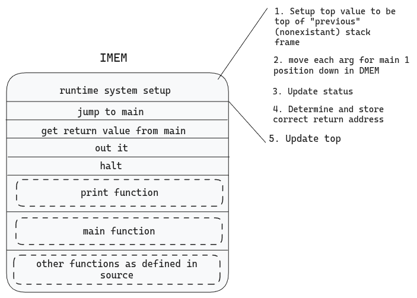
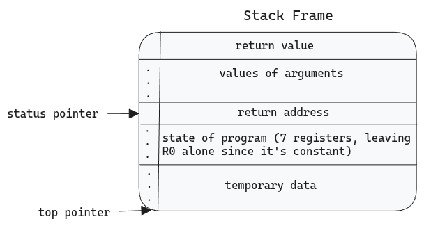
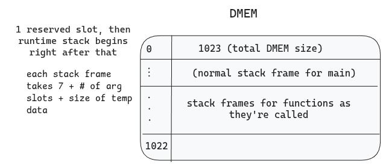
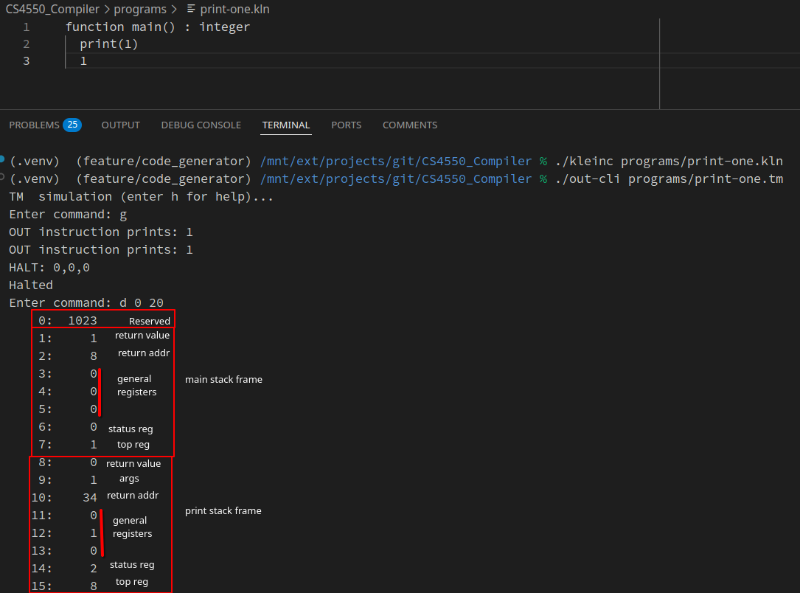

# Code Generator Memory Explained

## Section Specific Information

### Registers

- The first register (R0) is a constant representing the value 0.
- Registers 1-3 are used as general purpose registers
- Register 4 is reserved for holding the return value. Note: this design decision is not final and might be modified as we learn more about register allocation during module 6.
- Register 5 holds the status pointer (which points to the return address in the current stack frame)
- Register 6 holds the top pointer (which points past the end of the current stack frame)
- Register 7 is used to hold the program counter

### IMEM

- IMEM starts with the runtime system setup, which is effectively a "special" function call, which involves setting up some values
  - It puts top at 1 to make sure cell 0 in DMEM is not overwritten
  - Then, it moves each argument to the main function down one slot within DMEM
  - Following this, it updates status to be in the correct location
  - It then does some math to set the correct return address (which uses top as an intermediary register)
  - Next, it updates the top pointer to the new top
  - Finally, it executes a jump to the main function
  - There is then code to process the function return which simply outputs the return value (from register 4, though it could also read it from the stack frame since there is currently redundant return value storage until module 6 resolves this) and halts the program.
- IMEM then consists of the source code for print, which (1) stores the general purpose registers, (2) loads the argument into a register, (3) prints the register, (4) restores the general purpose registers, and (5) restores the top, status, and pc registers
- Finally, the remained of IMEM is generated code for any function defined within the klein program

### Stack Frames

- The stack frames first value is a cell allocated to the functions return value. This is currently redundant with register 4 being used to store the return value, but a final design decision will be made during module 6.
- The following "n" cells hold the arguments passed to that function in reverse order. That is, the first to appear will be the final argument, then the second to last argument, etc with the first argument being closest to the return address.
- Following the arguments, we have the return address
- Then, we have the state of the program when entering that function with some notable exclusions:
  - R0 is constant and is therefore not saved
  - R4 is the return value, so it not saved
  - R7 is the program counter and it not saved (because it will be restored via the return address)
- Finally, what left is space for any temporary data used within the function

### DMEM

- DMEM first starts with a cell that indicates the total size of the DMEM
- Then, it has a traditional stack frame for the main function
- Subsequently, each function call creates a new stack frame which is added to DMEM and upon its termination, that stack fram is deallocated.

### Real Example

- The following is a the DMEM after running an example print-one program in klein with highlighting for each sections of the stack frames within DMEM

## Calculating Offsets

### Calculating Offsets within a Stack Frame

- Within a stack frame, the main reference point is the "status pointer" (R5) which points to the "return address" cell within DMEM
  - Therefore, a 0 offset from the status pointer gives the return address
- Argument values can be accessed using negative offsets from the status pointer
  - E.g., -1 will be the first argument, -2 will be the second argument, etc
- Return value location can be access by doing a (-1 - argument count) offset from the status pointer
  - E.g., if the function has 2 arguments, it will be -1 - 2 = -3 offset from the status pointer to get the return value location
- Previous state of program register can be accessed with positive offsets from the status pointer. However, there are a few important notes:
  - Register 0 is skipped because it holds a constant and register 4 is skipped because it can be used to pass the return value. (This might be modified during the next module depending on how our register allocation works)
  - Additionally, register 7 is never stored because it would be redundant given the return address field
  - E.g., offset 1 will yield register 1, offset 2 will yield register 2
  - Register 5 will be accessed with offset 4 (because R4 is skipped) and register 6 accessed with offset 5
- Any offset greater than 6 is used for accessing temporary/local variable

### Calculating Offsets across Stack Frames

- Though calculating value within a stack frame using the status pointer is the preferred method of managing DMEM, sometimes it is required to determine offsets across frames. In this case, the "top pointer" (R6) is used as the reference and we will be talking about the following stack frame. This is most commonly, though not exclusively, used when building the new frame and doing initial setup.
- The return value of the next stack frame can be accessed with an offset of 0
- Arguments can be accessed with an offset of 1+ (in reverse order) depending on the number of arguments. The number of arguments "n" will be used in the remaining calculations
  - E.g., offset 1 gets the final argument, offset 2 gets the second to last argument, etc.
- The return address of the next stack frame can be access with an offset of 1+n
- Registers from the next stack frame can be accessed with offsets (2+n) through (6+n) corresponding to register 1,2,3,5,6
